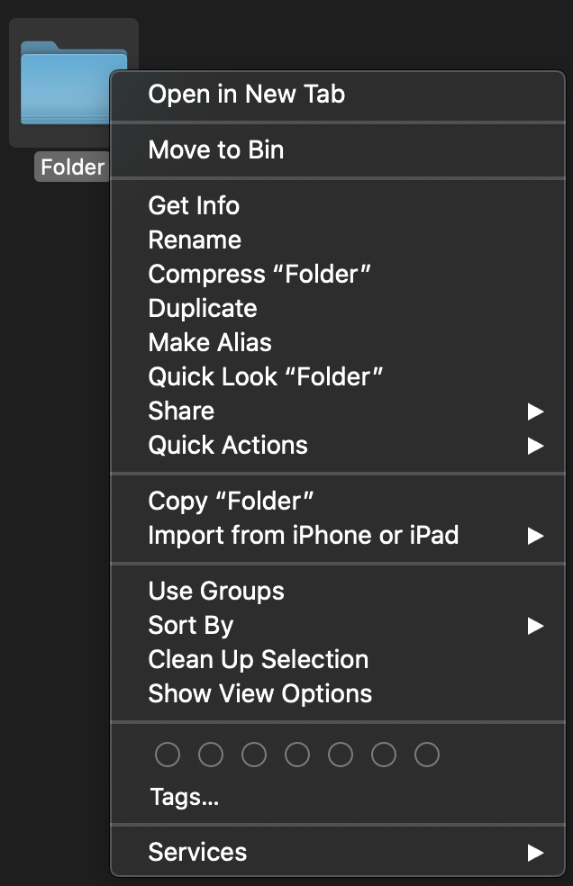
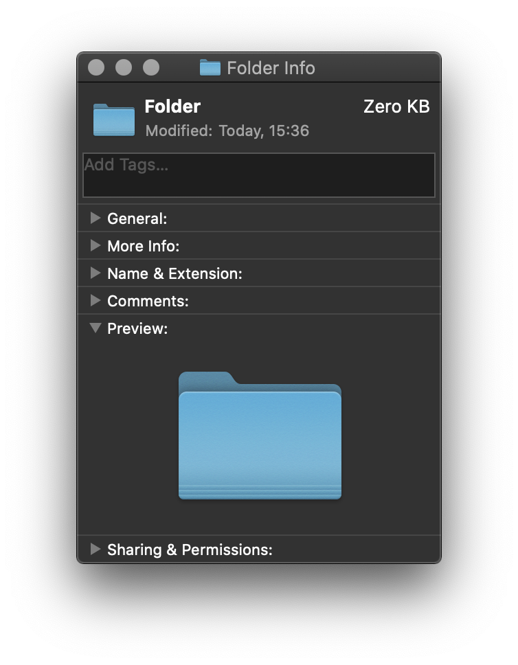

# Want your folder to go from this to this?

  

1. Download the png you want from the [Icons](https://github.uio.no/hermanno/MacFolders/tree/master/icons) folder.

2. After downloading it, open the png using preview and copy it to the clipboard (Command+C)

3. Navigate to the folder you want to change the look of.

4. Right click on the folder and click 'Get info'

5. Mark the small picture of the folder on top of the info tab and paste (Command+V)

Enjoy!
